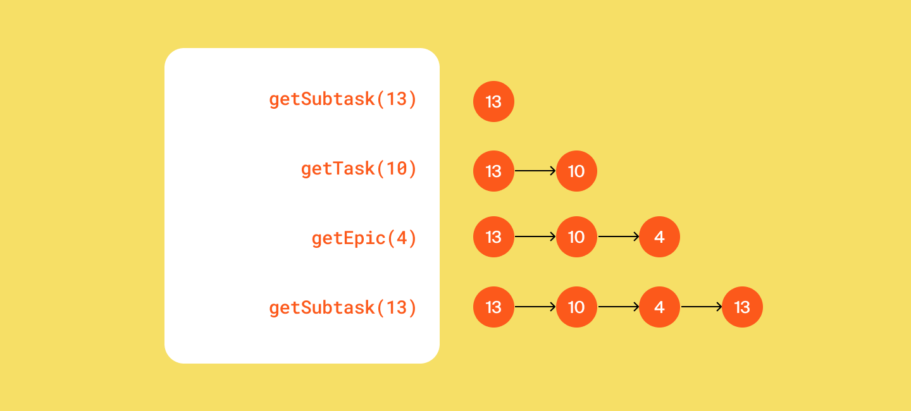
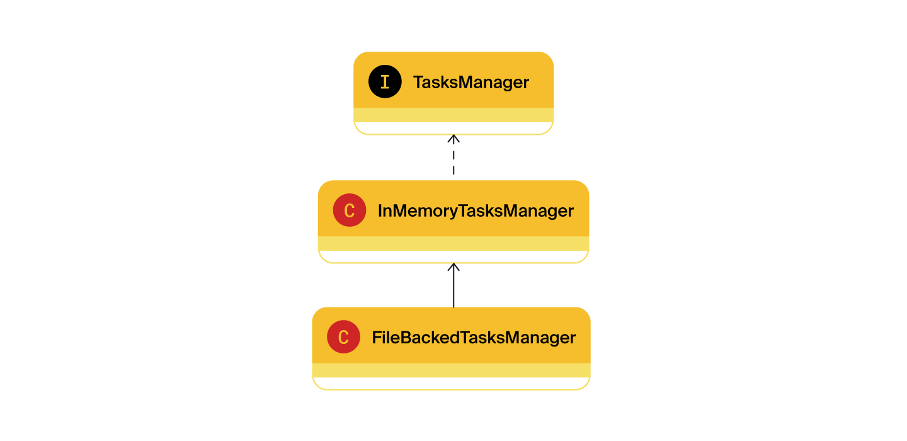
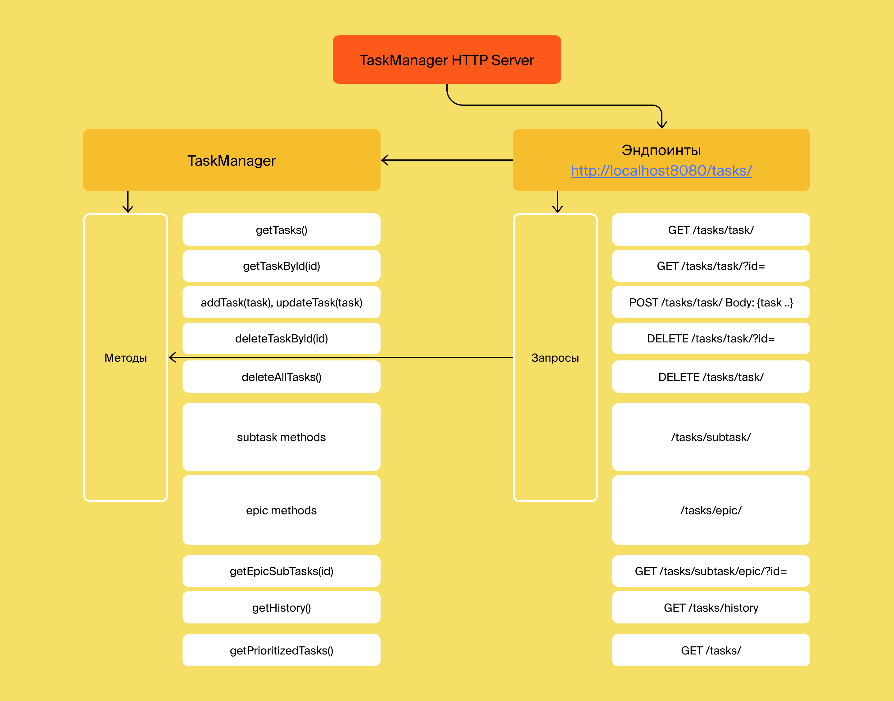

# java-kanban
Repository for homework project.

## **_СПРИНТ 3_**

## **Трекер задач**

Как системы контроля версий помогают команде работать с общим кодом, так и трекеры задач позволяют эффективно организовать совместную работу над задачами.
Данная программа, отвечает за формирование модели данных для трекера задач, изображенного на рисунке ниже:

### **Типы задач**

Простейшим кирпичиком такой системы является задача (англ. task). У задачи есть следующие свойства:
1. Название, кратко описывающее суть задачи (например, «Переезд»).
2. Описание, в котором раскрываются детали. 
3. Уникальный идентификационный номер задачи, по которому её можно будет найти. 
4. Статус, отображающий её прогресс. Мы будем выделять следующие этапы жизни задачи:
* NEW — задача только создана, но к её выполнению ещё не приступили.
* IN_PROGRESS — над задачей ведётся работа.
* DONE — задача выполнена.

Для выполнения масштабной задачи, задача разбивается на подзадачи (англ. subtask). Большая задача, которая делится на подзадачи, называется эпиком (англ. epic).
В программе задачи могут быть трёх типов: обычные задачи, эпики и подзадачи. Для них выполняются следующие условия:
* Для каждой подзадачи известно, в рамках какого эпика она выполняется.
* Каждый эпик знает, какие подзадачи в него входят.
* Завершение всех подзадач эпика считается завершением эпика.

### **Идентификатор задачи**

У каждого типа задач есть идентификатор. Это целое число, уникальное для всех типов задач. По нему находим, обновляем, удаляем задачи. При создании задачи менеджер присваивает ей новый идентификатор.

### **Менеджер задач**

Запускается на старте программы и управляет всеми задачами. В нём реализованы следующие функции:
1. Возможность хранить задачи всех типов.
2. Методы для каждого из типа задач(Задача/Эпик/Подзадача):
* Получение списка всех задач.
* Удаление всех задач.
* Получение по идентификатору.
* Создание. Задача передается в качестве параметра.
* Обновление. Новая версия объекта с верным идентификатором передаётся в виде параметра.
* Удаление по идентификатору.
3. Дополнительные методы:
* Получение списка всех подзадач определённого эпика.
4. Управление статусами осуществляется по следующему правилу:
* Менеджер сам не выбирает статус для задачи. Информация о нём приходит менеджеру вместе с информацией о самой задаче. По этим данным в одних случаях он будет сохранять статус, в других будет рассчитывать.
5. Для эпиков:
* если у эпика нет подзадач или все они имеют статус NEW, то статус NEW.
* если все подзадачи имеют статус DONE, то и эпик считается завершённым — со статусом DONE.
* во всех остальных случаях статус IN_PROGRESS.

### **Тестирование**

В классе Main реализовано тестирование основного функционала программы.

## **_СПРИНТ 4_**

### **Менеджер теперь интерфейс**

* Класс TaskManager стал интерфейсом. В нём собран список методов, которые должны быть у любого объекта-менеджера.
* Созданный ранее класс менеджера переименован в InMemoryTaskManager. Именно то, что менеджер хранит всю информацию в оперативной памяти, и есть его главное свойство, позволяющее эффективно управлять задачами.

### **История просмотров задач**

* Добавлена в программу новая функциональность — трекер отображает последние просмотренные пользователем задачи.

Пример формирования истории просмотров задач после вызовов методов менеджера:

### **Утилитарный класс**

* Со временем в приложении трекера появится несколько реализаций интерфейса TaskManager. Чтобы не зависеть от реализации, создан утилитарный класс Managers. На нём будет лежать вся ответственность за создание менеджера задач. То есть Managers будет сам подбирать нужную реализацию TaskManagerи возвращать объект правильного типа.

### **Статусы задач как перечисление**

* Так как варианты возможных статусов у задачи ограничены, для их хранения в программе создан перечисляемый тип enum.

## **_СПРИНТ 5_**

### **История просмотров задач**

* Убраны повторные просмотры и ограничения на размер истории.
* Время просмотра задачи никак не зависит от общего количества задач в истории.
* Протестирована работа менеджера истории.

## **_СПРИНТ 6_**

### **Вторая реализация менеджера**

* Добавлен класс менеджера, который будет после каждой операции автоматически сохранять все задачи и их состояние в специальный файл.

## **_СПРИНТ 7_**

* Добавлена продолжительность и дата старта задач

* Добавлена сортировка в порядке приоритета

* Добавлено покрытие кода тестами

## **_СПРИНТ 8_**

* Настроен доступ к методам менеджера через HTTP-запросы

* Добавлено хранение состояния менеджера из файлов на отдельный сервер

* Добавлено покрытие новой реализации менеджера тестами